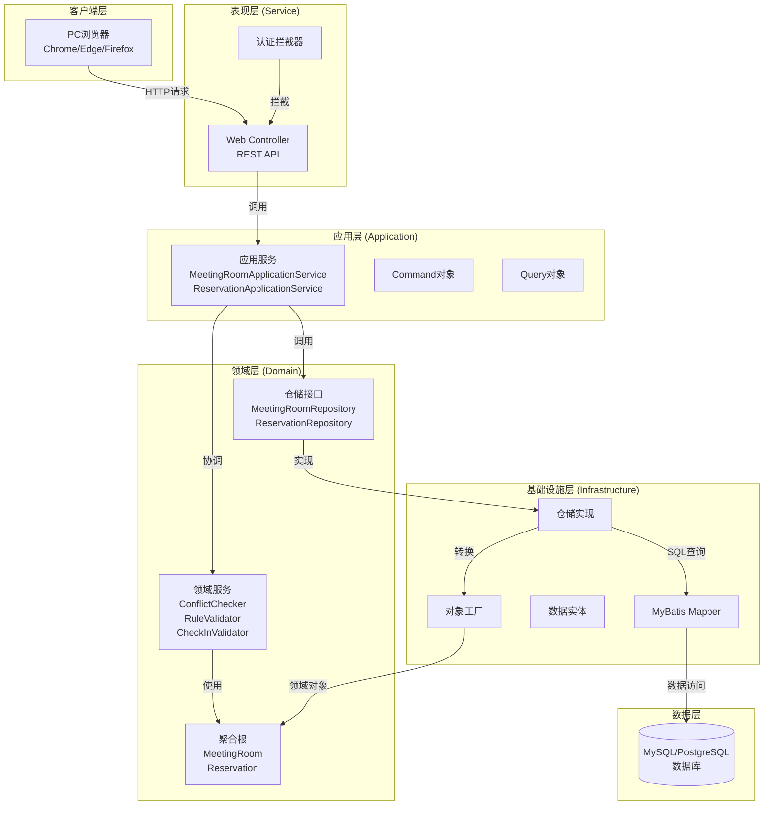
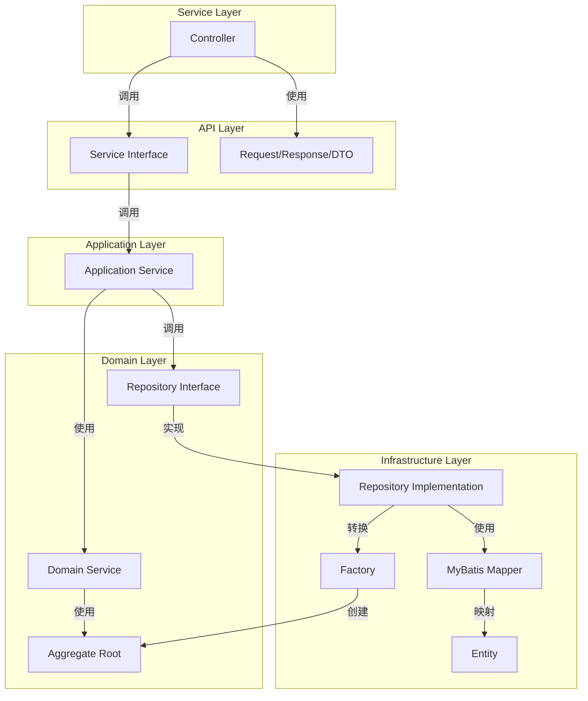
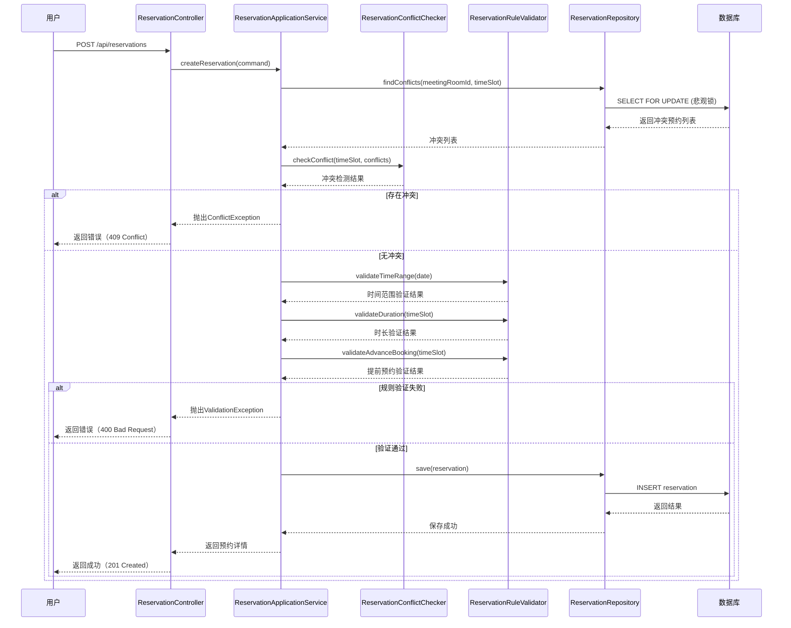
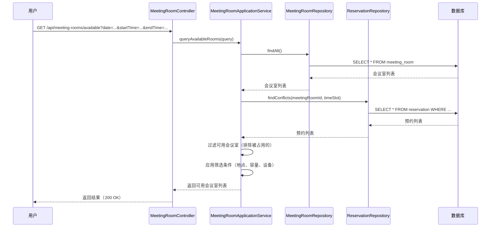
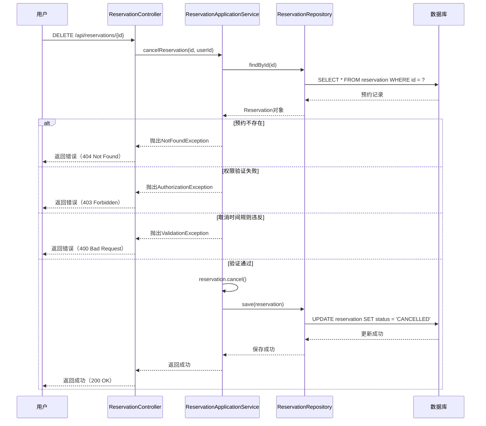

# AI会议室预约系统 - 架构设计文档

## 文档信息

- **文档版本**: v1.0
- **创建日期**: 2024-12-19
- **文档类型**: 架构设计文档 (Architecture Document)
- **项目名称**: AI会议室预约系统
- **架构师**: Architect Agent

---

## 一、引言 (Introduction)

本文档描述了AI会议室预约系统的整体技术架构，包括后端系统、数据模型、API设计、基础设施等。本文档作为AI驱动开发的架构蓝图，确保开发过程中的一致性和架构模式遵循。

**与前端架构的关系：**

本项目包含前端界面，前端架构文档将详细描述前端特定设计，必须与本文档结合使用。本文档中定义的核心技术栈选择（见"技术栈"章节）是整个项目的权威标准，包括前端组件。

### 项目基础

本项目基于现有的DDD分层架构项目结构，采用Monorepo管理方式。项目已包含以下模块：
- `ai-meeting-boot`: 启动模块
- `ai-meeting-service`: 服务层（Web控制器）
- `ai-meeting-infrastructure`: 基础设施层（数据访问实现）
- `ai-meeting-application`: 应用服务层
- `ai-meeting-domain`: 领域层（领域模型、领域服务）
- `ai-meeting-common`: 公共模块
- `ai-meeting-client`: 客户端模块
- `ai-meeting-api`: API定义模块

**变更日志**

| Date | Version | Description | Author |
|------|---------|-------------|--------|
| 2024-12-19 | v1.0 | 初始架构文档创建 | Architect Agent |

---

## 二、高层架构 (High Level Architecture)

### 2.1 技术摘要 (Technical Summary)

本系统采用**领域驱动设计（DDD）**架构模式，基于**Spring Boot单体应用**构建。系统遵循**六边形架构（Hexagonal Architecture）**原则，通过清晰的分层结构实现关注点分离：领域层封装核心业务逻辑，应用层协调业务流程，基础设施层处理技术实现细节。主要技术选择包括Spring Boot 2.7.10、Java 17、MyBatis数据访问框架、MySQL/PostgreSQL关系型数据库。系统采用RESTful API设计，支持PC浏览器前端访问。核心架构模式包括仓储模式（Repository Pattern）、应用服务模式（Application Service Pattern）、值对象模式（Value Object Pattern）等，确保业务逻辑与技术实现解耦，支持未来扩展和维护。

### 2.2 高层概览 (High Level Overview)

#### 架构风格

- **服务架构**: 单体架构（Monolith）
  - **决策理由**: MVP阶段功能范围明确，团队规模适中，单体架构能够简化开发和部署流程，降低系统复杂度，提高开发效率。后续可根据业务发展需要拆分为微服务。

- **仓库结构**: Monorepo
  - **决策理由**: 所有模块在同一仓库中管理，便于代码共享和依赖管理，符合项目现有结构。

- **主要用户交互流程**:
  1. 用户通过PC浏览器访问系统
  2. 用户登录系统（默认账号密码）
  3. 用户查询可用会议室（按日期、时间段、条件筛选）
  4. 用户创建预约（系统自动检测冲突和验证规则）
  5. 用户管理预约（查看、取消、签到）

#### 关键架构决策

1. **DDD分层架构**: 采用领域驱动设计，清晰划分领域层、应用层、基础设施层，确保业务逻辑与技术实现分离
2. **聚合根设计**: 识别MeetingRoom和Reservation两个核心聚合根，明确业务边界
3. **并发控制策略**: 使用数据库悲观锁（SELECT FOR UPDATE）结合事务，防止并发预约冲突
4. **业务规则配置化**: 所有业务规则通过配置文件管理，避免硬编码，便于调整
5. **RESTful API设计**: 遵循REST原则，提供清晰的API接口

### 2.3 高层架构图 (High Level Project Diagram)



### 2.4 架构和设计模式 (Architectural and Design Patterns)

- **六边形架构（Hexagonal Architecture）**: 将业务逻辑与外部依赖隔离，领域层为核心，基础设施层实现技术细节 - _理由_: 符合DDD原则，确保业务逻辑独立于技术实现，便于测试和维护

- **领域驱动设计（DDD）**: 以领域模型为核心，通过聚合根、实体、值对象、领域服务组织代码 - _理由_: 清晰表达业务概念，提高代码可读性和可维护性，符合项目现有架构

- **仓储模式（Repository Pattern）**: 抽象数据访问逻辑，领域层通过接口访问数据 - _理由_: 解耦领域层与数据访问层，便于测试（可Mock仓储），支持未来数据源切换

- **应用服务模式（Application Service Pattern）**: 应用层服务协调领域服务和仓储，处理用例流程 - _理由_: 封装用例逻辑，管理事务边界，转换DTO对象

- **值对象模式（Value Object Pattern）**: 使用不可变值对象表示业务概念（TimeSlot、Location等） - _理由_: 提高领域模型表达力，确保值对象不可变性，避免副作用

- **事务脚本模式（Transaction Script）**: 在应用服务中使用事务管理数据一致性 - _理由_: 确保预约创建、取消等操作的原子性，防止数据不一致

- **乐观锁/悲观锁模式**: 使用数据库锁机制防止并发冲突 - _理由_: 解决并发预约冲突问题，保证数据一致性

---

## 三、技术栈 (Tech Stack)

### 3.1 云基础设施 (Cloud Infrastructure)

- **Provider**: 待定（本地部署或云部署）
- **Key Services**: 待定
- **Deployment Regions**: 待定

### 3.2 技术栈表 (Technology Stack Table)

| Category | Technology | Version | Purpose | Rationale |
|----------|-----------|---------|---------|------------|
| **Language** | Java | 17 | 主要开发语言 | LTS版本，稳定可靠，团队熟悉 |
| **Framework** | Spring Boot | 2.7.10 | 后端框架 | 企业级框架，快速开发，丰富的生态 |
| **Data Access** | MyBatis | 2.3.2 | ORM框架 | 灵活SQL控制，性能优秀，符合项目选择 |
| **Database** | MySQL | 8.0+ | 关系型数据库 | 成熟稳定，广泛使用，支持事务 |
| **Database** | PostgreSQL | 13+ | 关系型数据库（备选） | 功能强大，支持复杂查询 |
| **Connection Pool** | Druid | 1.2.23 | 数据库连接池 | 性能优秀，监控完善，已配置 |
| **Validation** | Bean Validation | 2.0.1.Final | 数据验证 | JSR标准，Spring集成良好 |
| **API Documentation** | Swagger | 2.7.0 | API文档 | 自动生成API文档，便于测试 |
| **Build Tool** | Maven | 3.6+ | 构建工具 | 项目已使用，依赖管理完善 |
| **Logging** | Logback | - | 日志框架 | Spring Boot默认，性能优秀 |
| **Testing** | JUnit | 5 | 单元测试框架 | 现代化测试框架，功能强大 |
| **Testing** | Mockito | - | Mock框架 | 单元测试Mock工具 |
| **Testing** | Spring Boot Test | - | 集成测试 | Spring Boot测试支持 |
| **Code Generation** | Lombok | 1.18.34 | 代码生成 | 减少样板代码，提高开发效率 |
| **Object Mapping** | MapStruct | 1.5.0.Final | 对象映射 | 编译时生成，性能优秀 |

---

## 四、数据模型 (Data Models)

### 4.1 MeetingRoom（会议室聚合根）

**目的**: 管理会议室的基本信息和状态，是会议室查询和预约的核心实体。

**关键属性**:
- `id`: Long - 会议室唯一标识
- `name`: String - 会议室名称
- `location`: Location（值对象）- 位置信息（楼栋、楼层、房间号）
- `capacity`: Integer - 可容纳人数
- `equipmentList`: List<Equipment> - 设备列表（值对象集合）
- `status`: String - 状态（AVAILABLE/UNAVAILABLE/MAINTENANCE）
- `description`: String - 描述信息

**关系**:
- 一个会议室可以有多个设备（一对多）
- 一个会议室可以有多个预约（一对多，通过Reservation关联）

### 4.2 Reservation（预约聚合根）

**目的**: 管理预约的完整信息和生命周期，是系统的核心业务实体。

**关键属性**:
- `id`: Long - 预约唯一标识
- `meetingRoomId`: Long - 会议室ID（外键）
- `userId`: Long - 用户ID（创建人）
- `subject`: String - 会议主题
- `timeSlot`: TimeSlot（值对象）- 时间段（日期、开始时间、结束时间）
- `attendeeCount`: Integer - 参会人数
- `remark`: String - 备注信息
- `status`: ReservationStatus（值对象）- 预约状态（PENDING/CHECKED_IN/COMPLETED/CANCELLED）
- `checkInTime`: LocalDateTime - 签到时间（可选）
- `createTime`: LocalDateTime - 创建时间
- `updateTime`: LocalDateTime - 更新时间
- `version`: Integer - 乐观锁版本号（可选）

**关系**:
- 一个预约属于一个会议室（多对一）
- 一个预约属于一个用户（多对一）

### 4.3 User（用户实体）

**目的**: 管理用户信息，支持身份认证和权限控制。

**关键属性**:
- `id`: Long - 用户唯一标识
- `username`: String - 用户名（唯一）
- `name`: String - 姓名
- `email`: String - 邮箱
- `department`: String - 部门（可选）
- `role`: String - 角色（USER/ADMIN）

**关系**:
- 一个用户可以创建多个预约（一对多）

### 4.4 TimeSlot（时间段值对象）

**目的**: 表示时间段信息，不可变值对象。

**关键属性**:
- `date`: LocalDate - 日期
- `startTime`: LocalTime - 开始时间
- `endTime`: LocalTime - 结束时间

**行为**:
- `isOverlap(other)`: 检查是否与其他时间段重叠
- `getDuration()`: 获取时长（分钟）
- `isValid()`: 验证时间段是否有效（开始时间 < 结束时间）

### 4.5 Location（位置值对象）

**目的**: 表示会议室位置信息，不可变值对象。

**关键属性**:
- `building`: String - 楼栋
- `floor`: String - 楼层
- `roomNumber`: String - 房间号

### 4.6 Equipment（设备值对象）

**目的**: 表示会议室设备信息，不可变值对象。

**关键属性**:
- `type`: String - 设备类型（PROJECTOR/SCREEN/VIDEO_CONFERENCE/WHITEBOARD等）
- `name`: String - 设备名称
- `description`: String - 设备描述

### 4.7 ReservationStatus（预约状态值对象）

**目的**: 表示预约状态，枚举值对象。

**枚举值**:
- `PENDING`: 待开始
- `CHECKED_IN`: 已签到
- `COMPLETED`: 已结束
- `CANCELLED`: 已取消
- `NO_CHECK_IN`: 未签到（可选）

---

## 五、组件 (Components)

### 5.1 Domain Layer（领域层）

**职责**: 封装核心业务逻辑，包含聚合根、实体、值对象、领域服务和仓储接口。

**关键接口**:
- `MeetingRoomRepository`: 会议室仓储接口
- `ReservationRepository`: 预约仓储接口
- `ReservationConflictChecker`: 预约冲突检查服务
- `ReservationRuleValidator`: 预约规则验证服务
- `CheckInTimeValidator`: 签到时间验证服务

**依赖**: 无（领域层不依赖其他层）

**技术栈**: 纯Java，无框架依赖

### 5.2 Application Layer（应用层）

**职责**: 协调领域服务和仓储，处理用例流程，管理事务边界，转换DTO对象。

**关键接口**:
- `MeetingRoomApplicationService`: 会议室应用服务
- `ReservationApplicationService`: 预约应用服务

**依赖**: Domain Layer（领域层）

**技术栈**: Spring Framework（事务管理、依赖注入）

### 5.3 Infrastructure Layer（基础设施层）

**职责**: 实现数据访问逻辑，包括仓储实现、MyBatis Mapper、数据实体、对象工厂。

**关键接口**:
- `MeetingRoomRepositoryImpl`: 会议室仓储实现
- `ReservationRepositoryImpl`: 预约仓储实现
- `MeetingRoomMapper`: 会议室MyBatis Mapper
- `ReservationMapper`: 预约MyBatis Mapper

**依赖**: Domain Layer（实现领域层接口）、Application Layer（可选）

**技术栈**: MyBatis、Spring JDBC、数据库驱动

### 5.4 API Layer（API层）

**职责**: 定义API接口、Request/Response/DTO对象、Service接口定义。

**关键接口**:
- `MeetingRoomService`: 会议室服务接口
- `ReservationService`: 预约服务接口
- Request/Response/DTO对象定义

**依赖**: Application Layer（可选，用于接口定义）

**技术栈**: 纯Java接口定义，Swagger注解

### 5.5 Service Layer（服务层）

**职责**: 实现Web控制器、异常处理、安全配置、请求/响应转换。

**关键接口**:
- `MeetingRoomController`: 会议室控制器
- `ReservationController`: 预约控制器
- `AuthController`: 认证控制器
- `GlobalExceptionHandler`: 全局异常处理器

**依赖**: API Layer、Application Layer

**技术栈**: Spring MVC、Spring Security（可选）

### 5.6 Boot Layer（启动层）

**职责**: 应用启动类、配置文件、依赖注入配置。

**关键组件**:
- `ApplicationStarter`: 启动类
- `application.properties`: 应用配置
- Spring Boot自动配置

**依赖**: 所有其他层

**技术栈**: Spring Boot

### 5.7 组件关系图



---

## 六、外部API (External APIs)

本项目第一期不涉及外部API集成。后续迭代可能包括：
- 邮件服务API（通知功能）
- 统一身份认证API（SSO/LDAP）
- 消息推送API（消息通知）

---

## 七、核心工作流 (Core Workflows)

### 7.1 创建预约工作流



### 7.2 查询可用会议室工作流



### 7.3 取消预约工作流



---

## 八、REST API规范 (REST API Spec)

```yaml
openapi: 3.0.0
info:
  title: AI会议室预约系统 API
  version: 1.0.0
  description: 会议室预约管理系统的RESTful API接口文档

servers:
  - url: http://localhost:8080/api
    description: 开发环境

paths:
  /auth/login:
    post:
      summary: 用户登录
      tags:
        - 认证
      requestBody:
        required: true
        content:
          application/json:
            schema:
              $ref: '#/components/schemas/LoginRequest'
      responses:
        '200':
          description: 登录成功
          content:
            application/json:
              schema:
                $ref: '#/components/schemas/LoginResponse'
        '401':
          description: 用户名或密码错误

  /meeting-rooms/available:
    get:
      summary: 查询可用会议室
      tags:
        - 会议室
      parameters:
        - name: date
          in: query
          required: true
          schema:
            type: string
            format: date
        - name: startTime
          in: query
          required: true
          schema:
            type: string
            format: time
        - name: endTime
          in: query
          required: true
          schema:
            type: string
            format: time
        - name: location
          in: query
          schema:
            type: string
        - name: capacity
          in: query
          schema:
            type: integer
        - name: equipment
          in: query
          schema:
            type: array
            items:
              type: string
      responses:
        '200':
          description: 查询成功
          content:
            application/json:
              schema:
                type: array
                items:
                  $ref: '#/components/schemas/MeetingRoomDTO'

  /meeting-rooms/{id}:
    get:
      summary: 获取会议室详情
      tags:
        - 会议室
      parameters:
        - name: id
          in: path
          required: true
          schema:
            type: integer
      responses:
        '200':
          description: 查询成功
          content:
            application/json:
              schema:
                $ref: '#/components/schemas/MeetingRoomDetailDTO'
        '404':
          description: 会议室不存在

  /reservations:
    post:
      summary: 创建预约
      tags:
        - 预约
      requestBody:
        required: true
        content:
          application/json:
            schema:
              $ref: '#/components/schemas/CreateReservationRequest'
      responses:
        '201':
          description: 创建成功
          content:
            application/json:
              schema:
                $ref: '#/components/schemas/ReservationDTO'
        '400':
          description: 请求参数错误或业务规则违反
        '409':
          description: 时间冲突

  /reservations/{id}:
    get:
      summary: 获取预约详情
      tags:
        - 预约
      parameters:
        - name: id
          in: path
          required: true
          schema:
            type: integer
      responses:
        '200':
          description: 查询成功
          content:
            application/json:
              schema:
                $ref: '#/components/schemas/ReservationDetailDTO'
        '403':
          description: 无权限访问
        '404':
          description: 预约不存在
    delete:
      summary: 取消预约
      tags:
        - 预约
      parameters:
        - name: id
          in: path
          required: true
          schema:
            type: integer
      responses:
        '200':
          description: 取消成功
        '400':
          description: 取消规则违反
        '403':
          description: 无权限操作
        '404':
          description: 预约不存在

  /reservations/{id}/check-in:
    post:
      summary: 签到
      tags:
        - 预约
      parameters:
        - name: id
          in: path
          required: true
          schema:
            type: integer
      responses:
        '200':
          description: 签到成功
        '400':
          description: 签到时间窗口不符合
        '403':
          description: 无权限操作
        '404':
          description: 预约不存在

  /reservations/my:
    get:
      summary: 查询我的预约
      tags:
        - 预约
      parameters:
        - name: startDate
          in: query
          schema:
            type: string
            format: date
        - name: endDate
          in: query
          schema:
            type: string
            format: date
        - name: status
          in: query
          schema:
            type: string
            enum: [PENDING, CHECKED_IN, COMPLETED, CANCELLED]
        - name: page
          in: query
          schema:
            type: integer
            default: 1
        - name: size
          in: query
          schema:
            type: integer
            default: 20
      responses:
        '200':
          description: 查询成功
          content:
            application/json:
              schema:
                $ref: '#/components/schemas/ReservationListResponse'

components:
  schemas:
    LoginRequest:
      type: object
      required:
        - username
        - password
      properties:
        username:
          type: string
        password:
          type: string

    LoginResponse:
      type: object
      properties:
        userId:
          type: integer
        username:
          type: string
        name:
          type: string

    MeetingRoomDTO:
      type: object
      properties:
        id:
          type: integer
        name:
          type: string
        location:
          type: object
          properties:
            building:
              type: string
            floor:
              type: string
            roomNumber:
              type: string
        capacity:
          type: integer
        equipmentList:
          type: array
          items:
            type: object
            properties:
              type:
                type: string
              name:
                type: string
        availableStatus:
          type: string
          enum: [AVAILABLE, OCCUPIED]

    MeetingRoomDetailDTO:
      allOf:
        - $ref: '#/components/schemas/MeetingRoomDTO'
        - type: object
          properties:
            description:
              type: string
            schedule:
              type: array
              items:
                type: object
                properties:
                  subject:
                    type: string
                  startTime:
                    type: string
                    format: time
                  endTime:
                    type: string
                    format: time
                  status:
                    type: string

    CreateReservationRequest:
      type: object
      required:
        - meetingRoomId
        - date
        - startTime
        - endTime
        - subject
      properties:
        meetingRoomId:
          type: integer
        date:
          type: string
          format: date
        startTime:
          type: string
          format: time
        endTime:
          type: string
          format: time
        subject:
          type: string
        attendeeCount:
          type: integer
        remark:
          type: string

    ReservationDTO:
      type: object
      properties:
        id:
          type: integer
        meetingRoomId:
          type: integer
        meetingRoomName:
          type: string
        subject:
          type: string
        date:
          type: string
          format: date
        startTime:
          type: string
          format: time
        endTime:
          type: string
          format: time
        status:
          type: string
        attendeeCount:
          type: integer
        remark:
          type: string

    ReservationDetailDTO:
      allOf:
        - $ref: '#/components/schemas/ReservationDTO'
        - type: object
          properties:
            checkInTime:
              type: string
              format: date-time
            createTime:
              type: string
              format: date-time
            canCancel:
              type: boolean
            canCheckIn:
              type: boolean

    ReservationListResponse:
      type: object
      properties:
        total:
          type: integer
        page:
          type: integer
        size:
          type: integer
        items:
          type: array
          items:
            $ref: '#/components/schemas/ReservationDTO'
```

---

## 九、数据库设计 (Database Schema)

### 9.1 表结构设计

#### 9.1.1 user表（用户表）

```sql
CREATE TABLE `user` (
  `id` BIGINT NOT NULL AUTO_INCREMENT COMMENT '用户ID',
  `username` VARCHAR(50) NOT NULL COMMENT '用户名',
  `name` VARCHAR(100) NOT NULL COMMENT '姓名',
  `email` VARCHAR(100) COMMENT '邮箱',
  `department` VARCHAR(100) COMMENT '部门',
  `role` VARCHAR(20) NOT NULL DEFAULT 'USER' COMMENT '角色：USER/ADMIN',
  `password` VARCHAR(255) COMMENT '密码（加密）',
  `create_time` DATETIME NOT NULL DEFAULT CURRENT_TIMESTAMP COMMENT '创建时间',
  `update_time` DATETIME NOT NULL DEFAULT CURRENT_TIMESTAMP ON UPDATE CURRENT_TIMESTAMP COMMENT '更新时间',
  PRIMARY KEY (`id`),
  UNIQUE KEY `uk_username` (`username`),
  KEY `idx_role` (`role`)
) ENGINE=InnoDB DEFAULT CHARSET=utf8mb4 COMMENT='用户表';
```

#### 9.1.2 meeting_room表（会议室表）

```sql
CREATE TABLE `meeting_room` (
  `id` BIGINT NOT NULL AUTO_INCREMENT COMMENT '会议室ID',
  `name` VARCHAR(100) NOT NULL COMMENT '会议室名称',
  `building` VARCHAR(50) NOT NULL COMMENT '楼栋',
  `floor` VARCHAR(50) NOT NULL COMMENT '楼层',
  `room_number` VARCHAR(50) NOT NULL COMMENT '房间号',
  `capacity` INT NOT NULL COMMENT '可容纳人数',
  `status` VARCHAR(20) NOT NULL DEFAULT 'AVAILABLE' COMMENT '状态：AVAILABLE/UNAVAILABLE/MAINTENANCE',
  `description` TEXT COMMENT '描述信息',
  `create_time` DATETIME NOT NULL DEFAULT CURRENT_TIMESTAMP COMMENT '创建时间',
  `update_time` DATETIME NOT NULL DEFAULT CURRENT_TIMESTAMP ON UPDATE CURRENT_TIMESTAMP COMMENT '更新时间',
  PRIMARY KEY (`id`),
  KEY `idx_status` (`status`),
  KEY `idx_location` (`building`, `floor`)
) ENGINE=InnoDB DEFAULT CHARSET=utf8mb4 COMMENT='会议室表';
```

#### 9.1.3 meeting_room_equipment表（会议室设备表）

```sql
CREATE TABLE `meeting_room_equipment` (
  `id` BIGINT NOT NULL AUTO_INCREMENT COMMENT '设备ID',
  `meeting_room_id` BIGINT NOT NULL COMMENT '会议室ID',
  `equipment_type` VARCHAR(50) NOT NULL COMMENT '设备类型：PROJECTOR/SCREEN/VIDEO_CONFERENCE/WHITEBOARD等',
  `equipment_name` VARCHAR(100) NOT NULL COMMENT '设备名称',
  `description` VARCHAR(255) COMMENT '设备描述',
  `create_time` DATETIME NOT NULL DEFAULT CURRENT_TIMESTAMP COMMENT '创建时间',
  PRIMARY KEY (`id`),
  KEY `idx_meeting_room_id` (`meeting_room_id`),
  CONSTRAINT `fk_equipment_room` FOREIGN KEY (`meeting_room_id`) REFERENCES `meeting_room` (`id`) ON DELETE CASCADE
) ENGINE=InnoDB DEFAULT CHARSET=utf8mb4 COMMENT='会议室设备表';
```

#### 9.1.4 reservation表（预约表）

```sql
CREATE TABLE `reservation` (
  `id` BIGINT NOT NULL AUTO_INCREMENT COMMENT '预约ID',
  `meeting_room_id` BIGINT NOT NULL COMMENT '会议室ID',
  `user_id` BIGINT NOT NULL COMMENT '用户ID（创建人）',
  `subject` VARCHAR(200) NOT NULL COMMENT '会议主题',
  `date` DATE NOT NULL COMMENT '预约日期',
  `start_time` TIME NOT NULL COMMENT '开始时间',
  `end_time` TIME NOT NULL COMMENT '结束时间',
  `attendee_count` INT COMMENT '参会人数',
  `remark` TEXT COMMENT '备注信息',
  `status` VARCHAR(20) NOT NULL DEFAULT 'PENDING' COMMENT '状态：PENDING/CHECKED_IN/COMPLETED/CANCELLED',
  `check_in_time` DATETIME COMMENT '签到时间',
  `version` INT NOT NULL DEFAULT 0 COMMENT '乐观锁版本号',
  `create_time` DATETIME NOT NULL DEFAULT CURRENT_TIMESTAMP COMMENT '创建时间',
  `update_time` DATETIME NOT NULL DEFAULT CURRENT_TIMESTAMP ON UPDATE CURRENT_TIMESTAMP COMMENT '更新时间',
  PRIMARY KEY (`id`),
  KEY `idx_meeting_room_id` (`meeting_room_id`),
  KEY `idx_user_id` (`user_id`),
  KEY `idx_date` (`date`),
  KEY `idx_status` (`status`),
  KEY `idx_meeting_room_time` (`meeting_room_id`, `date`, `start_time`, `end_time`),
  CONSTRAINT `fk_reservation_room` FOREIGN KEY (`meeting_room_id`) REFERENCES `meeting_room` (`id`),
  CONSTRAINT `fk_reservation_user` FOREIGN KEY (`user_id`) REFERENCES `user` (`id`)
) ENGINE=InnoDB DEFAULT CHARSET=utf8mb4 COMMENT='预约表';
```

### 9.2 索引设计说明

1. **主键索引**: 所有表的主键自动创建主键索引
2. **唯一索引**: user表的username字段创建唯一索引，防止重复用户名
3. **外键索引**: reservation表和meeting_room_equipment表的外键字段创建索引，提高关联查询性能
4. **复合索引**: reservation表的`idx_meeting_room_time`复合索引用于冲突检测查询优化，包含meeting_room_id、date、start_time、end_time字段
5. **单列索引**: 常用查询字段创建索引，如status、date、user_id等

### 9.3 数据库设计原则

1. **规范化设计**: 遵循第三范式，减少数据冗余
2. **外键约束**: 使用外键保证数据完整性
3. **索引优化**: 根据查询模式创建合适的索引
4. **字符集**: 使用utf8mb4字符集，支持emoji和特殊字符
5. **时间字段**: 使用DATETIME类型，支持时区处理（后续可扩展）

---

## 十、源代码树结构 (Source Tree)

```
ai-meeting/
├── ai-meeting-boot/                    # 启动模块
│   └── src/main/java/com/only/ai/boot/
│       └── ApplicationStarter.java      # 启动类
│   └── src/main/resources/
│       ├── application.properties       # 应用配置
│       ├── application-dev.properties   # 开发环境配置
│       ├── application-test.properties # 测试环境配置
│       ├── application-pre.properties  # 预发布环境配置
│       ├── application-prod.properties # 生产环境配置
│       └── logback-boot.xml            # 日志配置
│
├── ai-meeting-service/                  # 服务层（Web控制器）
│   └── src/main/java/com/only/ai/meeting/
│       └── service/
│           ├── web/
│           │   ├── controller/
│           │   │   ├── AuthController.java
│           │   │   ├── MeetingRoomController.java
│           │   │   └── ReservationController.java
│           │   ├── request/             # 请求对象
│           │   ├── response/            # 响应对象
│           │   ├── config/              # Web配置
│           │   │   ├── WebMvcConfig.java
│           │   │   └── SecurityConfig.java
│           │   └── filter/              # 过滤器
│           │       └── AuthFilter.java
│           └── exception/               # 异常处理
│               └── GlobalExceptionHandler.java
│
├── ai-meeting-api/                      # API定义模块
│   └── src/main/java/com/only/ai/meeting/
│       └── api/
│           ├── common/                  # 公共定义
│           │   ├── consts/              # 常量
│           │   ├── enums/               # 枚举
│           │   └── exception/           # 异常类
│           └── service/                 # 服务接口定义
│               ├── MeetingRoomService.java
│               ├── ReservationService.java
│               ├── request/             # 请求DTO
│               ├── response/            # 响应DTO
│               └── dto/                 # 数据传输对象
│
├── ai-meeting-application/              # 应用服务层
│   └── src/main/java/com/only/ai/meeting/
│       └── application/
│           ├── service/
│           │   ├── MeetingRoomApplicationService.java
│           │   └── ReservationApplicationService.java
│           ├── command/                 # 命令对象
│           │   ├── CreateReservationCommand.java
│           │   └── CancelReservationCommand.java
│           ├── query/                   # 查询对象
│           │   ├── QueryAvailableRoomsQuery.java
│           │   └── QueryMyReservationsQuery.java
│           └── result/                  # 结果对象
│               ├── MeetingRoomResult.java
│               └── ReservationResult.java
│
├── ai-meeting-domain/                   # 领域层
│   └── src/main/java/com/only/ai/meeting/
│       └── domain/
│           ├── model/                   # 领域模型
│           │   ├── MeetingRoom.java     # 会议室聚合根
│           │   ├── Reservation.java     # 预约聚合根
│           │   ├── User.java            # 用户实体
│           │   └── valueobject/         # 值对象
│           │       ├── TimeSlot.java
│           │       ├── Location.java
│           │       ├── Equipment.java
│           │       └── ReservationStatus.java
│           ├── service/                  # 领域服务
│           │   ├── ReservationConflictChecker.java
│           │   ├── ReservationRuleValidator.java
│           │   └── CheckInTimeValidator.java
│           ├── repository/              # 仓储接口
│           │   ├── MeetingRoomRepository.java
│           │   └── ReservationRepository.java
│           └── event/                    # 领域事件（可选）
│
├── ai-meeting-infrastructure/            # 基础设施层
│   └── src/main/java/com/only/ai/meeting/
│       └── infrastructure/
│           ├── dal/                     # 数据访问层实现
│           │   ├── MeetingRoomRepositoryImpl.java
│           │   └── ReservationRepositoryImpl.java
│           ├── mapper/                  # MyBatis Mapper接口
│           │   ├── MeetingRoomMapper.java
│           │   ├── ReservationMapper.java
│           │   └── UserMapper.java
│           ├── entity/                  # 数据实体
│           │   ├── MeetingRoomEntity.java
│           │   ├── ReservationEntity.java
│           │   └── UserEntity.java
│           ├── factory/                 # 对象工厂
│           │   ├── MeetingRoomFactory.java
│           │   └── ReservationFactory.java
│           └── config/                  # 基础设施配置
│               ├── MyBatisConfig.java
│               └── DataSourceConfig.java
│   └── src/main/resources/
│       └── mapper/                       # MyBatis XML映射文件
│           ├── MeetingRoomMapper.xml
│           ├── ReservationMapper.xml
│           └── UserMapper.xml
│
├── ai-meeting-common/                   # 公共模块
│   └── src/main/java/com/only/ai/meeting/
│       └── common/
│           ├── util/                     # 工具类
│           ├── constant/                # 常量
│           └── exception/               # 公共异常
│
├── ai-meeting-client/                   # 客户端模块（可选）
│   └── src/main/java/com/only/ai/meeting/
│       └── client/
│           └── MeetingRoomClient.java
│
└── pom.xml                              # Maven父POM
```

---

## 十一、基础设施和部署 (Infrastructure and Deployment)

### 11.1 基础设施即代码 (Infrastructure as Code)

- **工具**: 待定（可选：Terraform、Ansible）
- **位置**: `infrastructure/`（如需要）
- **方法**: 手动部署或容器化部署

### 11.2 部署策略 (Deployment Strategy)

- **策略**: 单体应用部署，支持多环境
- **CI/CD平台**: 待定（建议：Jenkins、GitLab CI）
- **Pipeline配置**: `.gitlab-ci.yml` 或 `Jenkinsfile`（如需要）

### 11.3 环境 (Environments)

- **dev（开发环境）**: 本地开发环境，使用application-dev.properties配置
- **test（测试环境）**: 测试环境，用于集成测试和功能测试
- **pre（预发布环境）**: 预发布环境，用于生产前验证
- **prod（生产环境）**: 生产环境，使用application-prod.properties配置

### 11.4 环境提升流程 (Environment Promotion Flow)

```
开发环境 (dev) 
    ↓ (代码合并到测试分支)
测试环境 (test) 
    ↓ (测试通过，合并到主分支)
预发布环境 (pre) 
    ↓ (预发布验证通过)
生产环境 (prod)
```

### 11.5 回滚策略 (Rollback Strategy)

- **主要方法**: 版本回退（Git标签 + 重新部署）
- **触发条件**: 
  - 生产环境出现严重Bug
  - 性能严重下降
  - 数据一致性异常
- **恢复时间目标（RTO）**: 15分钟内完成回滚

### 11.6 部署方式

#### 方式1: 传统部署
- 打包为JAR文件
- 使用 `java -jar` 命令运行
- 使用Nginx作为反向代理（可选）

#### 方式2: 容器化部署（推荐）
- 使用Docker打包应用
- 使用Docker Compose管理多容器（应用 + 数据库）
- 支持Kubernetes部署（后续扩展）

---

## 十二、错误处理策略 (Error Handling Strategy)

### 12.1 通用方法 (General Approach)

- **错误模型**: 分层异常体系，业务异常与系统异常分离
- **异常层次结构**:
  ```
  Exception (系统异常)
    ├── BusinessException (业务异常基类)
    │   ├── ConflictException (冲突异常)
    │   ├── ValidationException (验证异常)
    │   └── AuthorizationException (权限异常)
    └── NotFoundException (资源不存在异常)
  ```
- **错误传播**: 领域层抛出业务异常，应用层捕获并转换，Controller层统一处理

### 12.2 日志标准 (Logging Standards)

- **库**: Logback（Spring Boot默认）
- **格式**: JSON格式（生产环境）或文本格式（开发环境）
- **级别定义**:
  - `ERROR`: 系统错误、异常情况
  - `WARN`: 警告信息、业务规则违反
  - `INFO`: 关键业务操作（创建预约、取消预约等）
  - `DEBUG`: 调试信息（开发环境）
- **必需上下文**:
  - **关联ID**: 使用MDC（Mapped Diagnostic Context）记录请求ID
  - **服务上下文**: 记录服务名称、版本
  - **用户上下文**: 记录用户ID（不记录敏感信息）

### 12.3 错误处理模式 (Error Handling Patterns)

#### 外部API错误
- **重试策略**: 不适用（第一期无外部API）
- **断路器**: 不适用
- **超时配置**: HTTP请求超时30秒
- **错误转换**: 统一转换为业务异常

#### 业务逻辑错误
- **自定义异常**: 
  - `ConflictException`: 预约冲突（HTTP 409）
  - `ValidationException`: 业务规则违反（HTTP 400）
  - `AuthorizationException`: 权限不足（HTTP 403）
  - `NotFoundException`: 资源不存在（HTTP 404）
- **用户友好错误**: 所有业务异常包含用户友好的错误消息
- **错误码系统**: 使用错误码标识具体错误类型（如：RESERVATION_CONFLICT、TIME_RANGE_INVALID）

#### 数据一致性
- **事务策略**: 使用Spring的`@Transactional`注解管理事务
- **补偿逻辑**: 预约创建失败时自动回滚，无需补偿
- **幂等性**: 预约创建支持幂等性检查（通过时间戳和用户ID）

---

## 十三、编码标准 (Coding Standards)

### 13.1 核心标准 (Core Standards)

- **语言和运行时**: Java 17, Spring Boot 2.7.10
- **代码风格**: 遵循Google Java Style Guide或项目统一规范
- **Linting**: 使用Checkstyle或SpotBugs进行代码检查
- **测试组织**: 测试类与源文件同包，命名规则：`{ClassName}Test.java`

### 13.2 命名约定 (Naming Conventions)

| 元素 | 约定 | 示例 |
|------|------|------|
| 类名 | 大驼峰（PascalCase） | `MeetingRoomApplicationService` |
| 方法名 | 小驼峰（camelCase） | `createReservation` |
| 常量 | 全大写下划线分隔 | `MAX_ADVANCE_DAYS` |
| 包名 | 全小写，点分隔 | `com.only.ai.meeting.domain` |
| 数据库表 | 小写下划线分隔 | `meeting_room` |
| 数据库字段 | 小写下划线分隔 | `meeting_room_id` |

### 13.3 关键规则 (Critical Rules)

- **所有API响应必须使用统一的响应包装类**: `ApiResponse<T>`
- **数据库查询必须使用Repository模式**: 禁止在Service层直接使用MyBatis Mapper
- **所有业务规则验证必须在领域服务中**: 禁止在Controller或Application Service中硬编码业务规则
- **所有异常必须记录日志**: 使用Logger记录异常，包含上下文信息
- **所有外部输入必须验证**: 使用Bean Validation（`@Valid`）在Controller层验证
- **事务边界必须在Application Service层**: 使用`@Transactional`注解，不在Repository层使用
- **值对象必须不可变**: 所有值对象类使用`final`修饰，字段使用`final`，不提供setter方法

### 13.4 Java特定指南 (Java-Specific Guidelines)

- **使用Lombok减少样板代码**: 实体类使用`@Data`、`@Builder`等注解
- **使用MapStruct进行对象转换**: DTO与领域对象之间的转换使用MapStruct
- **使用Optional处理可能为null的值**: 避免NullPointerException
- **使用Stream API处理集合**: 提高代码可读性
- **避免使用魔法数字**: 使用常量或配置项

---

## 十四、测试策略和标准 (Test Strategy and Standards)

### 14.1 测试理念 (Testing Philosophy)

- **方法**: 单元测试 + 集成测试相结合
- **覆盖率目标**: 核心业务逻辑（领域层）≥80%，整体覆盖率≥70%
- **测试金字塔**: 
  - 单元测试：70%（领域模型、领域服务、应用服务）
  - 集成测试：20%（API接口、数据访问层）
  - E2E测试：10%（关键业务流程）

### 14.2 测试类型和组织 (Test Types and Organization)

#### 单元测试
- **框架**: JUnit 5
- **文件约定**: `{ClassName}Test.java`
- **位置**: `src/test/java`，与源文件同包结构
- **Mock库**: Mockito
- **覆盖率要求**: ≥80%

**AI Agent要求**:
- 为所有公共方法生成测试
- 覆盖边界情况和错误条件
- 遵循AAA模式（Arrange, Act, Assert）
- Mock所有外部依赖

#### 集成测试
- **范围**: API接口、数据访问层、事务管理
- **位置**: `src/test/java`，包名以`.integration`结尾
- **测试基础设施**:
  - **数据库**: Testcontainers PostgreSQL（推荐）或H2内存数据库
  - **Spring Boot Test**: 使用`@SpringBootTest`注解
  - **MyBatis**: 使用真实数据库进行测试

#### 端到端测试
- **框架**: 待定（建议：RestAssured + JUnit 5）
- **范围**: 关键业务流程（创建预约、取消预约、签到）
- **环境**: 独立的测试环境
- **测试数据**: 使用测试数据工厂创建测试数据

### 14.3 测试数据管理 (Test Data Management)

- **策略**: 每个测试用例独立准备数据，测试后清理
- **Fixtures**: 使用测试数据构建器（Builder Pattern）
- **工厂模式**: 使用Factory类创建测试对象
- **清理策略**: 使用`@Transactional`和`@Rollback`自动回滚，或使用`@Sql`脚本清理

### 14.4 持续测试 (Continuous Testing)

- **CI集成**: 在CI/CD流水线中运行所有测试
- **性能测试**: 使用JMeter或Gatling进行性能测试（可选）
- **安全测试**: 使用OWASP ZAP进行安全扫描（可选）

---

## 十五、安全 (Security)

### 15.1 输入验证 (Input Validation)

- **验证库**: Bean Validation (JSR-303)
- **验证位置**: Controller层，使用`@Valid`注解
- **必需规则**:
  - 所有外部输入必须验证
  - 在API边界验证，处理前验证
  - 优先使用白名单方法，而非黑名单

### 15.2 认证和授权 (Authentication & Authorization)

- **认证方法**: Session机制（第一期），后续可扩展JWT Token
- **会话管理**: 使用Spring Session管理会话
- **必需模式**:
  - 所有API接口（除登录接口）需要认证
  - 使用拦截器或过滤器验证用户身份
  - 预约操作验证用户权限（只能操作自己的预约）

### 15.3 密钥管理 (Secrets Management)

- **开发环境**: 使用application-dev.properties，不提交敏感信息到Git
- **生产环境**: 使用环境变量或密钥管理服务（如Vault）
- **代码要求**:
  - 绝不硬编码密钥
  - 仅通过配置服务访问密钥
  - 不在日志或错误消息中记录密钥

### 15.4 API安全 (API Security)

- **速率限制**: 使用Spring Security的Rate Limiting（可选）
- **CORS策略**: 配置允许的前端域名
- **安全头**: 设置安全响应头（X-Content-Type-Options、X-Frame-Options等）
- **HTTPS强制**: 生产环境强制使用HTTPS

### 15.5 数据保护 (Data Protection)

- **静态加密**: 数据库敏感字段加密（如用户密码）
- **传输加密**: 使用HTTPS加密传输
- **PII处理**: 不在日志中记录用户敏感信息（密码、完整身份证号等）
- **日志限制**: 不记录敏感数据，错误消息不暴露系统内部信息

### 15.6 依赖安全 (Dependency Security)

- **扫描工具**: 使用OWASP Dependency-Check或Snyk扫描依赖漏洞
- **更新策略**: 定期更新依赖，修复安全漏洞
- **审批流程**: 新增依赖需要团队审批

### 15.7 安全测试 (Security Testing)

- **SAST工具**: 使用SonarQube进行静态代码分析
- **DAST工具**: 使用OWASP ZAP进行动态安全测试（可选）
- **渗透测试**: 定期进行安全审计（可选）

---

## 十六、检查清单结果报告 (Checklist Results Report)

_此部分将在运行架构检查清单后填充。_

---

## 十七、下一步 (Next Steps)

### 17.1 前端架构

由于项目包含UI组件，建议：

1. **创建前端架构文档**: 使用Frontend Architecture模板
2. **参考本文档**: 前端架构必须与本文档中定义的技术栈选择保持一致
3. **关键UI需求**: 
   - PC浏览器适配（Chrome、Edge、Firefox、Safari）
   - 响应式设计（最小分辨率1366×768）
   - 会议室查询页面设计
   - 预约创建流程优化
   - 时间轴可视化展示

### 17.2 开发启动

1. **与产品负责人评审**: 确认架构设计符合需求
2. **开始Story实现**: 使用Dev Agent开始Epic 1的实现
3. **基础设施设置**: 设置开发环境、数据库、CI/CD流水线

### 17.3 架构师提示

**前端架构创建提示**:

基于本架构文档，请创建详细的前端架构文档。重点关注：
- 前端技术栈选择（Vue.js 3.x 或 React）
- UI组件库选择（Element Plus 或 Ant Design）
- 前端项目结构
- 状态管理方案
- API调用封装
- 路由设计
- 关键页面的组件设计

请参考本文档中的REST API规范和用户体验目标，确保前端架构与后端架构协调一致。

---

**文档结束**
